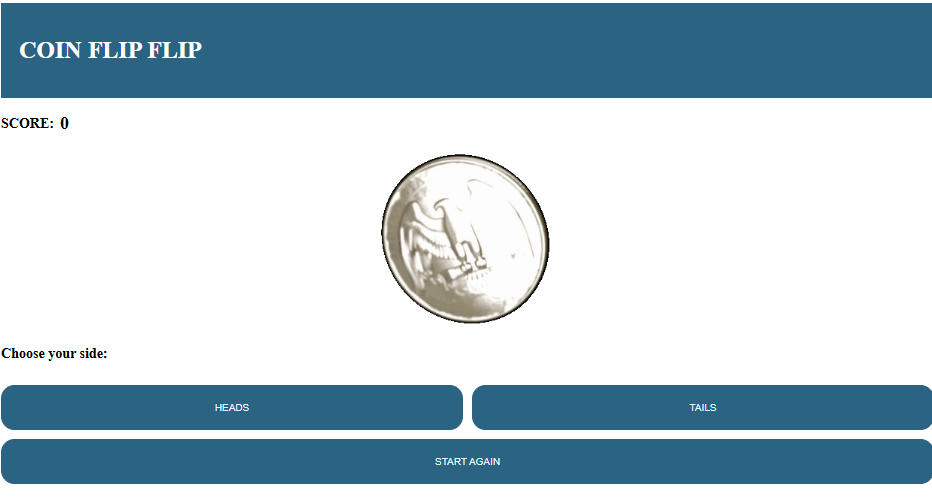

# 💸 Project: Node Coin Flip Game

### Goal: Create a simple web application that uses the fs and http modules. Use http to create the server and fs to read your html file. Include vanilla ES6 js in a script tag at the bottom of your html file. Try creating a coin flip guessing game

## How It looks like

## How It Works
### Coin Flip API (Node.js Server)
- The custom API handles the game logic and returns JSON responses.
- Generates a random coin flip (50/50 chance between Heads and Tails)
- Compares the user's choice with the random result
- Returns a JSON response with the flip result, win/lose status, and message

### Frontend Application
- User selects Heads or Tails by clicking a button
- The app displays a coin flip animation (gif)
- Sends a fetch request to the server's API
- Receives the JSON response
- Displays the result image (heads.png or tails.png)
- Updates the accumulative score (+1 for win, -1 for lose)
- Provides a Reset button to start a new game and clear the score

## Techonologies Used
- Node.js : Backend server (HTTP module)
- FS Module : Serve static files (HTML, CSS, JS, images)
- URL & Querystring : Parse request parameters
- Figlet : Generate ASCII art for 404 page
- HTML5
- CSS3
- Javascript (ES6)
- Fetch API: HTTP requests to server

## How to Run
- npm install figlet
- node flip.js
- open in browser: http://localhost:8000

## Future Improvements
- Look the score by localStorage to persist it across page reloads
- Move the score to the server-side to prevent cheating
- Add a betting system with virtual coins
- Add sound effects for coin flip and win/lose
- Add game statistics
- Add multiplayer

